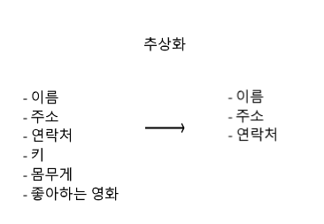
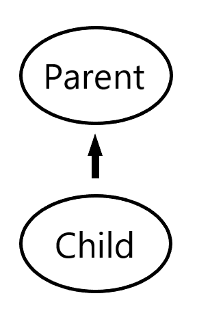
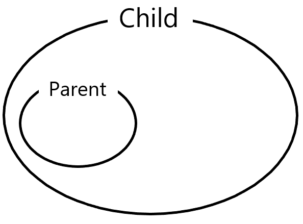

# 객체지향 프로그래밍

- 객체지향 프로그래밍(Object Oriented Programming) 은 좀 더 나은 프로그램을 만들기 위한 프로그래밍 패러다임이다.

- 재사용성이 높고 유지보수가 용이하다

  - 재사용성
  - 유지보수
  - 중복제거

  

### 클래스

- 객체를 정의해 놓은것
- 객체를 만드는데 사용되는 틀, 설계도
- 객체를 생성할때 사용

클래스에서 객체를 만드는 과정 : 인스턴스화

객체의 구성요소 -  속성, 기능


ex) 자동차

속성 : 엔진, 바퀴, 창문

기능 : 움직인다, 멈춘다


### 추상화(Abstraction)

- 관련된 정보를 제외하고 부적절한 정보를 제거하는 프로세스

- 추상화 과정은 모델링이라고도 한다 

- 추상화 프로세스를 통해 복잡성을 줄이고 효율성을 높이기 위해 객체에 대한 관련 데이터를 제외한 모든 것을 숨긴다

  


### 캡슐화 (Encapsulation)

- 객체의 구성요소 중 일부에 대한 외부의 접근을 제한하기 위한 매커니즘
- 데이터와 해당 데이터에 작동하는 메소드의 묶음 (getter, setter)
- 외부로부터 데이터를 보호하기 위해서 사용
- 정보 은닉을 통해서 낮은 결합도와 높은 응집도를 갖게한다
- 정보를 찾아볼때 아래 내용이 많이 나왔지만 이는 클래스에 대한 설명

- ~~객체의 기능과 속성을 하나로 묶는것~~

- ~~비슷한 역할을 하는 속성과 메소드 들을 하나의 클래스로 모으는것~~
- ~~즉, 기능과 속성의 모음을 '클래스'라는 '캡슐'에 분류해서 넣는것~~

예시

```javascript
 function factory_movie(title){
    return{
        get_title : function(){
            return title;
        },
        set_title : function(_title){
            title = _title;
        }
    }
}
ghost = factory_movie('Ghost in the shell');
matrix = factory_movie('Matrix');
console.log(ghost.get_title()); //'Ghost in the shell'
console.log(matrix.get_title()); //'Matrix'


ghost.set_title('ghost');
console.log(ghost.get_title()); // 'ghost'
```


### 상속(Inheritance)

- 기존의 클래스를 재사용해서 새로운 클래스를 작성하는것
- 적은 양의 코드로 새로운 클래스를 작성 할 수 있다

- 코드를 공통으로 관리 할 수 있기 때문에 코드의 추가 및 변경이 매우 용이

상속 관계도



클래스 Parent 와 Child의 다이어 그램




### 다형성

- 여러가지 형태를 가질 수 있는 능력

1. 정적 다형성

- 메소드 오버로딩
- 이름은 같지만 다른 매개변수를 받는 여러 메소드를 구현 가능
  - 매개변수의 갯수가 달라야함
  - 매개변수 타입이 달라야함
  - 매개변수는 같고 리턴 타입이 다른 경우는 성립하지 않음

2. 동적 다형성

- 오버라이딩
- 부모 클래스에 선언되어 있는 메소드와 동일한 메소드를 자식 클래스에서 선언해서 사용하는것
- 이름, 매개변수타입, 갯수, 리턴타입이 모두 같아야한다 = 동일하게 선언되어있다
- 동일한 시그니처를 가진다.

```java
public class ParentOverrinding{
	public ParentOverriding(){
        System.out.println("ParentOverriding Constructor");
    }
    public void printName(){
        System.out.println("printName() - ParentOverriding");
    }
}

public class ChildOverriding extends ParentOverrinding{
	public ChildOverriding(){
        System.out.println("ChildOverriding Constructor");
    }
    public void printName(){
        System.out.println("ChildOverrding printName()");
    }
}

public static void main(String[] args){
    ChildOverriding child = new ChildOverriding();
    child.printName(); // "ChildOverrding printName()"
}
```


### reference

- [자바의신](<http://www.yes24.com/Product/goods/8533700>)

- [Java의 정석](<http://www.yes24.com/Product/goods/24259565>)
- [stackify.com](<https://stackify.com/oops-concepts-in-java/>)

- [en.wikipedia.org](https://en.wikipedia.org/wiki/Encapsulation_(computer_programming))


