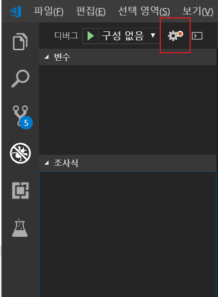

# Vscode 에서 C++ 컴파일, 디버깅하기(window10)

1. MinGW 설치하기
https://sourceforge.net/projects/mingw/files/latest/download  

     
     

- 패키지 선택 후 Apply Changes

     

- 환경변수에 C:\MinGW\bin 추가

     

- gcc --version
- g++ --version
- 설치확인

2. 확장프로그램 설치
    - Code Runer
    - C/C++
     

3. 설졍 편집

     

- 파일-기본설정-설정 으로 진입

- Code-runner:Run In Terminal     

- settings.json 진입

- 코드편집
- cpp파일별로 개별로 exe파일 생성하고 싶으면 주석처리 부분을 사용
- *.gitignore 파일을 생성해서 a.exe or .exe파일과 .vscode/ 폴더를 git에서 무시할수 있다*
~~~
{
    "editor.suggestSelection": "first",
    "vsintellicode.modify.editor.suggestSelection": "automaticallyOverrodeDefaultValue",
    "files.autoSave": "afterDelay",
    "code-runner.executorMap": {
        "cpp": "cd $dirWithoutTrailingSlash && g++ $fileName -g -o a && ./a.exe",
        //파일별로 exe파일 생성시
        //"cpp": "cd $dirWithoutTrailingSlash && g++ $fileName -g -o $fileNameWithoutExt && ./$fileNameWithoutExt.exe",

    },
    "window.zoomLevel": 0,
    "code-runner.runInTerminal": true
}
~~~

- Ctrl + Alt + N 으로 실행
- 터미널 창을이용해 입력 가능
- *컴파일 설정 완료*

4. 디버깅 환경설정

- Ctrl + Shift + D 디버깅 창 열기
- 톱니바퀴 모양 클릭
- C++ (GDB/LLDB) 선택

- launch.json 파일 생성 및 코드 수정
- "program": "${fileDirname}/a.exe", // exe 파일 경로 설정 개별 exe설정으로 한 경우는 주석처리한 코드사용
- "cwd": "${workspaceFolder}", //work 디렉토리
- "miDebuggerPath":"C:/MinGW/bin/gdb.exe", // gdb.exe 파일 경로 설정

~~~

{
    // IntelliSense를 사용하여 가능한 특성에 대해 알아보세요.
    // 기존 특성에 대한 설명을 보려면 가리킵니다.
    // 자세한 내용을 보려면 https://go.microsoft.com/fwlink/?linkid=830387을(를) 방문하세요.
    "version": "0.2.0",
    "configurations": [
        
        {
            "name": "(gdb) Launch",
            "type": "cppdbg",
            "request": "launch",
            "program": "${fileDirname}/a.exe",
            //파일별로 exe파일 생성시
            //"program": "${fileDirname}/${fileBasenameNoExtension}.exe",
            "args": [],
            "stopAtEntry": false,
            "cwd": "${workspaceFolder}",
            "environment": [],
            "externalConsole": true,
            "MIMode": "gdb",
            "miDebuggerPath":"C:/MinGW/bin/gdb.exe",
            "setupCommands": [
                {
                    "description": "Enable pretty-printing for gdb",
                    "text": "-enable-pretty-printing",
                    "ignoreFailures": true
                }
            ]
        }
    ]
}
~~~

- F5 로 디버깅 구동 확인
- *구동 후 콘솔창이 바로 종료되는 현상 해결 필요*
